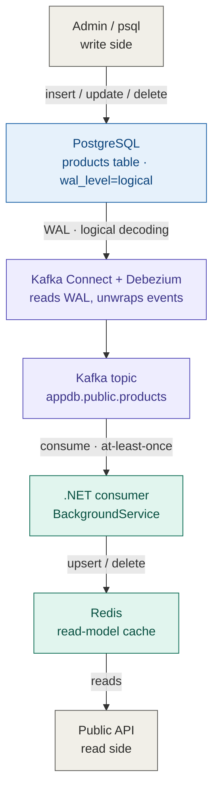

# .NET CDC with Debezium, Postgresql and Kafka

# Debezium CDC: PostgreSQL → Kafka → .NET → Redis (read-model)

A runnable scaffold demonstrating Change Data Capture: every change on the
`products` table in Postgres is captured by Debezium via the WAL, pushed to
Kafka, and a .NET consumer syncs it into Redis as a read-model (the CQRS
read-side).

```
Admin UPDATE Postgres → WAL → Debezium (Kafka Connect)
    → topic appdb.public.products → .NET consumer → Redis → API reads
```

## Architecture



The key boundary is the `WAL · logical decoding` edge: Debezium reads Postgres'
log rather than calling the app or hooking into write-side code, so the write
side never knows anyone is listening. That decoupling is exactly why CDC is
attractive versus the Outbox pattern — no change to the write path.

## Requirements
- Docker + Docker Compose
- .NET SDK 10
## Layout
```
debezium-cdc/
├── docker-compose.yml          # Postgres, Kafka (KRaft), Debezium Connect, Redis, Kafka UI
├── db/init.sql                 # creates products table + REPLICA IDENTITY FULL + seed
├── connect/
│   ├── connector-config.json   # Debezium config (the "config" block, for PUT)
│   └── register-connector.sh   # waits for Connect to be healthy, then PUT (idempotent)
└── src/CdcConsumer/            # .NET 8 worker: consumes CDC → Redis
```

## Run

### 1. Bring up the infrastructure
```bash
docker compose up -d
```
The `connector-init` service waits for Connect to become healthy and registers
the connector via `PUT` (idempotent) — no manual `curl` needed. Re-running `up`
any number of times is safe.
 
Checks:
- Kafka UI: http://localhost:8080
- Connector status:
```bash
    curl -s http://localhost:8083/connectors/appdb-connector/status
```
Expect state `RUNNING`.

### 2. Run the .NET consumer (on the host)
```bash
cd src/CdcConsumer
dotnet run
```
The consumer connects to Kafka via `localhost:29092` and Redis via
`localhost:6379`. On startup you'll see the **initial snapshot** in the logs —
the two seed rows from `init.sql` flow into Redis with no separate migration code.

### 3. Test end-to-end
Open psql:
```bash
docker exec -it cdc-postgres psql -U postgres -d appdb
```
```sql
INSERT INTO products(name, price) VALUES ('Pencil 2B', 3000);   -- INSERT
UPDATE products SET price = 2500 WHERE name = 'Pencil 2B';       -- UPDATE
DELETE FROM products WHERE name = 'Pencil 2B';                   -- DELETE
```
The consumer log will print Upsert → Upsert → Delete in turn.

Inspect Redis:
```bash
docker exec -it cdc-redis redis-cli KEYS "product:*"
docker exec -it cdc-redis redis-cli GET "product:1"
```

### Change kafka connect config

Update `docker/kafka-connect/connector-config.json`
then run
```bash
docker compose up -d --force-recreate kafka connect
cd src/CdcConsumer && dotnet run
```

## Key design notes

- **Register the connector once per cluster.** The config lives in Kafka's `connect_configs` topic, not in a file. Restarting Connect does not require re-registration. Re-register only when Kafka data is wiped, or when deploying to a new cluster. Use `PUT` (upsert) instead of `POST` so the pipeline is idempotent and won't break on `409 Conflict`.
- **At-least-once.** Debezium may deliver duplicate messages on restart/failure. Here the side effect is `StringSet`/`KeyDelete` — naturally idempotent, so duplicates are harmless. If the side effect is NOT idempotent (sending email, incrementing a balance), you must dedupe yourself using offset/LSN or by comparing `updated_at`/`ts_ms`.
- **Ordering per key.** Debezium partitions by primary key → all events for the same `id` land in the same partition → correct order per product. If you change the partitioning strategy (e.g. by `TenantId`), re-verify this assumption.
- **REPLICA IDENTITY FULL** lets DELETE/UPDATE events retain full non-key column values. For large tables, weigh the extra WAL cost.

## Teardown
```bash
docker compose down -v --rmi local  # -v also removes volumes (Postgres + Kafka) -> clean reset
```
Note: `-v` wipes `connect_configs` → next time `connector-init` must re-register
(it does so automatically on `up`).
